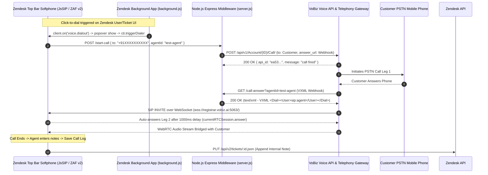

# Zendesk: Exotel / Zendesk CTI vs VoBiz
**VoBiz — CRM & Telephony Integration Review** | Prepared for internal planning meeting

## Product PRD: VoBiz × Zendesk Calling Integration — Competitor Analysis (Exotel / Zendesk CTI) and VoBiz Implementation Plan
* **Version:** 0.1  
* **Date:** 2026-09-06  
* **Status:** Draft  
* **Author:** Drafted on behalf of Dheeraj (dheeraj@vobiz.ai)  
* **Stakeholders:** TBD — needs assignment; intended for review with senior engineering before implementation begins  

---

### A note on sourcing
Everything in **Part 1 (Exotel / Zendesk CTI)** is drawn from Exotel's official developer documentation, Zendesk CTI & Talk Partner Edition framework specs, and Zendesk Admin Center integration guidelines.  
Everything in **Part 2 (VoBiz)** describes what has actually been built and verified live in the `zendesk-vobiz-calling-app` codebase (ZAF v2 softphone widget, `background.js` click-to-dial relay, `backend/server.js` Express middleware, and WebRTC SIP integration over `wss://registrar.vobiz.ai:5063/`), plus clearly-marked proposed architectural refinements (such as backend-driven CDR sync and multi-tenant agent auth).

---

## Part 1 — How Exotel / Standard CTI Does It on Zendesk

### 1.1 Two accounts, two separate setup halves
Exotel's Zendesk CTI integration consists of two independent setup halves that connect via webhooks and API tokens:
1. **Exotel Dashboard Configuration**: Building the telephony call flow, assigning virtual PSTN numbers (ExoPhones), and configuring webhook event URLs.
2. **Zendesk Admin Center Configuration**: Installing the Exotel CTI App from Zendesk Marketplace (or uploading a private app), configuring Zendesk API tokens, enabling top bar/background app locations, and mapping agent extensions.

Neither setup phase requires touching the other until credentials and callback URLs are swapped.

---

### 1.2 Exotel-side / Telephony Provider Setup

* **Step 1 — Retrieve Account API Credentials.**  
  Inside Exotel (under *My Account → API Settings*), three credentials are generated: **Account SID** (e.g. `fitnessequipments1`), **API Key**, and **API Token**.

* **Step 2 — Build a Telephony Flow in App Bazaar.**  
  In Exotel's visual call flow builder (*App Bazaar → Custom Apps → Create*), a new flow is named (e.g., `"Zendesk Support Flow"`).

* **Step 3 — Attach a Connect Applet to Agent Groups.**  
  Inside the flow builder, a **Connect Applet** is added to dial a pre-configured agent group or queue (e.g., *Support Operations*, *Tier 1 Escalations*).

* **Step 4 — Configure Webhook Callback URLs.**  
  Exotel routes telephony events to hosted middleware endpoints using the standard format:
  `https://<exotel_APIKey>:<exotel_APIToken>@zendesk.mum1.exotel.in/v2/accounts/<accountSid>/call-events?event=<event_type>`
  
  | Event | Trigger Location | Purpose |
  | :--- | :--- | :--- |
  | `pop` | Connect Applet ("Create popup...") | Fired when an agent answers; triggers Zendesk screen-pop via CTI API. |
  | `answered` | Passthru Applet (Call Ended) | Fired post-call; attaches call recording link, duration, and metrics to ticket. |
  | `missed` | Passthru Applet (No Answer) | Fired when unanswered; auto-creates a "Missed Call" task ticket in Zendesk. |

* **Step 5 — Assign ExoPhone DID Numbers.**  
  The newly built flow is attached to a virtual phone number under *ExoPhones → Attach Flow*.

---

### 1.3 Zendesk-side Setup

* **Step 6 — Install Exotel CTI App in Zendesk.**  
  Navigate to *Zendesk Admin Center → Apps and integrations → Zendesk Support Apps → Marketplace*, search for `"Exotel CTI"`, and click **Install**.

* **Step 7 — Fill in App Configuration Parameters.**  
  The installation form requires:
  * **Zendesk Subdomain** (e.g., `company.zendesk.com`)
  * **Zendesk Admin API Token**
  * **Exotel Account SID**
  * **Exotel API Key & Token**
  * **Exotel Region** (e.g., `Singapore` / `India`)
  * **Role Access Filters** (e.g., `Admins`, `Agents`)

* **Step 8 — Generate Zendesk API Token.**  
  The installer navigates to *Zendesk Admin Center → Apps and integrations → APIs → Zendesk API*, enables Token Access, and generates a dedicated API Token for CTI background writes.

* **Step 9 — Enable App Locations.**  
  The app registers two locations in Zendesk Support:
  * `top_bar`: Softphone floating popover pane for manual dialing and active call controls.
  * `background`: Invisible background script listening for global click-to-dial events (`voice.dialout`).

* **Step 10 — Map Telephony Agents to Zendesk Users.**  
  In the app's settings panel, an admin performs **UserSync** (matching agent email addresses between Exotel and Zendesk) or uploads a CSV mapping file.

* **Step 11 — Edit Individual Agent Mapping.**  
  Each mapped agent profile is configured with:
  * **Caller ID** (Outbound PSTN number selection)
  * **Mobile / SIP Extension** (e.g., `+919876543210` or `sip:agent101`)
  * **Outbound Calling Enabled** (Toggle flag)

---

### 1.4 The Working Result

* **Embedded Softphone Widget**: Docked in the Zendesk top navigation bar (`top_bar`). Includes a numeric dialpad, caller ID status, call duration timer, and disposition notes field.
* **Click-to-Dial Integration**: Clicking any phone number inside a Zendesk User Profile or Ticket Sidebar automatically opens the softphone pane and initiates dialing.
* **Automated Ticket Creation & Logging**: Completed calls create or update Zendesk tickets with call metadata (Direction, Duration, Recording URL, Agent Summary, Disposition).

---

### 1.5 Inbound, Outbound, CDR, and Recordings — How Exotel Works

* **Outbound**: Agent clicks a phone link or uses the dialpad → CTI app sends REST request to Exotel → Exotel dials customer first, then bridges agent.
* **Inbound**: Inbound call hits ExoPhone → `pop` webhook fires → CTI app uses Zendesk User Search (`/api/v2/search.json?query=type:user phone:...`) and pops the customer's profile or ticket. If unassigned, `missed` event creates a "Missed Call" ticket.
* **CDR**: Call details are written to Zendesk ticket internal notes and displayed in the widget's local Call History tab.
* **Recordings**: Audio recording link is generated and attached to the ticket note after a documented 3–5 minute processing window.

---

### 1.6 Exotel's Auth Model Summarized

1. **Exotel Telephony Credentials** (SID + Key + Token): Embedded in webhook URLs and server settings once by an admin.
2. **Zendesk API Token**: Configured once in the CTI App Settings for Zendesk REST API access.
3. **Per-Agent Mapping**: Admins map phone numbers/SIP IDs to Zendesk user IDs without agents having to enter credentials manually.

---

## Part 2 — How VoBiz Does It (Zendesk Integration)

### 2.1 The Strategic Decision This Section Assumes
Rather than submitting to the public Zendesk Marketplace initially, VoBiz distributes the integration as a private Custom App (`zcli apps:package` artifact) alongside an open Node.js backend repository. Customers upload the package directly into *Zendesk Admin Center → Apps and integrations → Zendesk Support Apps → Upload private app*. This avoids lengthy marketplace review while delivering full native performance.

---

### 2.2 What's Already Built vs. What's Proposed

* **Already Built & Verified Live in `zendesk-vobiz-calling-app`**:
  * **ZAF v2 Frontend App (`zendesk-app/`)**:
    * `manifest.json`: Configured for `top_bar` (300x500px popover softphone) and `background` location.
    * `background.js`: Global listener for `voice.dialout` click-to-dial events, opening `top_bar` popover and triggering `cti.triggerDialer`.
    * `app.js`: Softphone WebRTC stack using `JsSIP.UA` registered against `wss://registrar.vobiz.ai:5063/` with Google STUN (`stun:stun.l.google.com:19302`).
    * Zendesk User Resolution: Queries `/api/v2/search.json?query=type:user phone:<cleanPhone>` to resolve caller profiles.
    * Ticket Context Detection: Scans active workspace instances (`client.get('instances')`) for open `ticket_sidebar` tabs.
    * Ticket Logging: Appends internal notes to active tickets (`PUT /api/v2/tickets/:id.json`) or creates new Solved Task tickets (`POST /api/v2/tickets.json`).
    * Standalone Fallback Mode: Runs cleanly outside Zendesk iframe for local development (`http://localhost:4567/assets/index.html`).
  * **Express Backend Middleware (`backend/server.js`)**:
    * `GET /agent/:agentId`: Returns agent SIP credentials from `agents.json`.
    * `POST /start-call`: Initiates customer PSTN leg via VoBiz REST API (`POST https://api.vobiz.ai/api/v1/Account/{authId}/Call/`) with customer-first dialing.
    * `GET/POST /call-answer`: Returns VXML `<Response><Speak>Connecting...</Speak><Dial><User>sip:agent</User></Dial></Response>` to bridge call leg to agent softphone.
    * `tunnel-url.txt`: Reads dynamic local tunnel URLs (e.g. ngrok / localtunnel) for webhook callbacks.

* **Proposed Refinements (§2.7)**:
  * **Backend Automated CDR Sync (`syncCallToZendesk()`)**: Server-side webhook handler for `/recording-ready` to write ticket logs even if the agent closes their browser.
  * **Multi-Tenant Per-Agent Auth (`POST /login`)**: Dynamic VoBiz credential verification via `GET /api/v1/auth/me` and dynamic phone number fetching via `GET /Account/{authId}/numbers`.
  * **In-Widget Call History Tab**: Recent CDR retrieval via `GET /Account/{authId}/cdr/recent`.

---

### 2.3 Architecture & Component Breakdown



---

### 2.4 VoBiz-Side Authentication Model

#### Current Implementation (Verified in Codebase)
* Credentials (`VOBIZ_AUTH_ID`, `VOBIZ_AUTH_TOKEN`, `VOBIZ_FROM_NUMBER`) are defined server-side in `.env`.
* Agents are defined in `backend/agents.json`:
  ```json
  {
    "test-agent": {
      "sipUser": "agentjohn403814661276504964978078",
      "sipPassword": "secret_password",
      "displayName": "Test Agent"
    }
  }
  ```
* Softphone fetches registration credentials via `GET /agent/:agentId`.

#### Proposed Multi-Tenant Login Model
In multi-tenant setups, agents login dynamically via `POST /login`:
```javascript
async function handleLogin(req, res) {
  const { agentId, authId, authToken } = req.body;
  const headers = { "X-Auth-ID": authId, "X-Auth-Token": authToken };

  // Validate credentials against VoBiz platform
  const meRes = await fetch("https://api.vobiz.ai/api/v1/auth/me", { headers });
  if (!meRes.ok) {
    return res.status(401).json({ error: "Invalid VoBiz credentials" });
  }

  // Fetch account numbers
  const numbersRes = await fetch(`https://api.vobiz.ai/api/v1/Account/${authId}/numbers`, { headers });
  const numbersData = await numbersRes.json();
  const numbers = (numbersData.items || []).map(n => n.e164);

  agentSessions.set(agentId, { authId, authToken, from: numbers[0] || null, numbers });
  res.json({ ok: true, numbers, selected: numbers[0] || null });
}
```

---

### 2.5 WebSockets SIP Stack & Webhook Execution

1. **WebRTC Softphone Registration**:
   The frontend connects using `JsSIP.UA`:
   ```javascript
   const vobizSocket = new JsSIP.WebSocketInterface("wss://registrar.vobiz.ai:5063/");
   vobizUA = new JsSIP.UA({
     sockets: [vobizSocket],
     uri: `sip:${agent.sipUser}`,
     password: agent.sipPassword,
     register: true,
     pcConfig: {
       iceServers: [{ urls: ["stun:stun.l.google.com:19302"] }]
     }
   });
   ```

2. **VXML Webhook Response (`/call-answer`)**:
   When the customer answers, VoBiz requests `/call-answer?agentId=...`. The server responds with strict `text/xml`:
   ```xml
   <?xml version="1.0" encoding="UTF-8"?>
   <Response>
     <Speak voice="WOMAN" language="en-IN">Connecting you to your agent. Please hold.</Speak>
     <Dial>
       <User>sip:agentjohn403814661276504964978078@registrar.vobiz.ai</User>
     </Dial>
   </Response>
   ```

3. **1-Second Auto-Answer Delay**:
   To ensure the WebRTC media pipeline and SDP negotiation initialize without audio clipping, the softphone auto-answers after 1,000ms:
   ```javascript
   setTimeout(() => {
     if (currentRTCSession && currentRTCSession.status !== 8) {
       currentRTCSession.answer({ mediaConstraints: { audio: true, video: false } });
     }
   }, 1000);
   ```

---

### 2.6 Outbound Call Flow — Endpoint by Endpoint

| Step | Initiator | Target Endpoint | Payload / Behavior |
| :---: | :--- | :--- | :--- |
| 1 | Zendesk UI | `voice.dialout` Event | User clicks phone number; `background.js` opens `top_bar` popover. |
| 2 | Top Bar Widget | `POST /start-call` | `{ "to": "+91XXXXXXXXXX", "agentId": "test-agent" }` |
| 3 | Backend Server | `POST https://api.vobiz.ai/api/v1/Account/{ID}/Call/` | Initiates customer call with `answer_url = "${tunnelUrl}/call-answer?agentId=..."` |
| 4 | VoBiz Telephony | Customer PSTN | Dials customer's mobile phone number first. |
| 5 | VoBiz Telephony | `GET /call-answer?agentId=...` | Customer answers → VoBiz fetches VXML instructions. |
| 6 | Backend Server | VoBiz Telephony | Returns VXML `<Dial><User>sip:agent</User></Dial>`. |
| 7 | VoBiz Telephony | Softphone Widget | Triggers SIP `INVITE` over `wss://registrar.vobiz.ai:5063/`. |
| 8 | Softphone Widget | `currentRTCSession.answer()` | Auto-answers after 1000ms; WebRTC audio stream connects. |
| 9 | Agent Widget | `PUT /api/v2/tickets/:id.json` or `POST /api/v2/tickets.json` | Agent enters notes and clicks **Save Call Log**. |

---

### 2.7 Step 7 — Closing the Zendesk CDR Gap (Proposed Backend Sync)

Currently, call logging is triggered directly from the agent's browser via ZAF Client (`client.request()`). While effective during an active session, if an agent closes Zendesk before saving, the call log could be lost.

#### Proposed Solution: Automated Server-Side Sync (`syncCallToZendesk`)
When VoBiz posts the `/recording-ready` callback to the backend, the backend executes `syncCallToZendesk()` using a stored Zendesk Admin API token:

```javascript
// Proposed backend enhancement
async function syncCallToZendesk(callData, zendeskSubdomain, zendeskApiToken) {
  const auth = "Basic " + Buffer.from(`admin@company.com/token:${zendeskApiToken}`).toString("base64");
  
  // 1. Search for customer by phone number
  const cleanPhone = callData.To.replace(/[^\d+]/g, "");
  const searchRes = await fetch(`https://${zendeskSubdomain}.zendesk.com/api/v2/search.json?query=type:user phone:${cleanPhone}`, {
    headers: { Authorization: auth }
  });
  const searchData = await searchRes.json();
  const requesterId = (searchData.results && searchData.results[0]) ? searchData.results[0].id : null;

  // 2. Create Solved Task ticket with recording link
  await fetch(`https://${zendeskSubdomain}.zendesk.com/api/v2/tickets.json`, {
    method: "POST",
    headers: { Authorization: auth, "Content-Type": "application/json" },
    body: JSON.stringify({
      ticket: {
        subject: `VoBiz Call — ${callData.To}`,
        comment: {
          body: `Call Duration: ${callData.Duration}s\nRecording Link: ${callData.RecordingUrl}`,
          public: false
        },
        type: "task",
        status: "solved",
        requester_id: requesterId
      }
    })
  });
}
```

---

### 2.8 Transcription & Recording Flow

1. **Recording Generation**: VoBiz completes audio recording post-call and posts to `/recording-ready`.
2. **Transcription Webhook**: When automated transcription is enabled (`<Record transcriptionType="auto" transcriptionUrl="...">`), VoBiz posts transcript text to `/transcription-ready`.
3. **Ticket Attachment**: The transcript is automatically appended to the Zendesk ticket comment thread.

---

### 2.9 Real-Time Status, Click-to-Dial, and Standalone Fallback

* **Global Click-to-Dial**: `background.js` handles Zendesk `voice.dialout` events:
  ```javascript
  client.on('voice.dialout', function(event) {
    getTopBarClient().then(topBarClient => {
      if (topBarClient) {
        topBarClient.invoke('popover', 'show');
        topBarClient.trigger('cti.triggerDialer', { number: event.number, ticketId: event.ticketId });
      }
    });
  });
  ```
* **DTMF Pass-through**: In-call dialpad button presses trigger `currentRTCSession.sendDTMF(key)`.
* **Standalone Fallback Mode**: When opened directly (`http://localhost:4567/assets/index.html`), the app detects `!window.location.search.includes('origin=')`, bypasses ZAF client calls gracefully, and logs test output to the browser console.

---

### 2.10 Inbound Calling Architecture (Current vs. Roadmap)

* **Current Implementation**: VoBiz dials the customer, then uses VXML `<Dial><User>sip:agent</User></Dial>` to bridge to the agent's WebRTC softphone. The softphone receives `newRTCSession` with `originator === "remote"` and displays the incoming caller UI.
* **Roadmap Expansion**: Inbound PSTN DID routing (customer calls virtual number directly → VoBiz webhook triggers backend → backend resolves assigned agent → triggers Zendesk screen-pop and SIP INVITE).

---

## Part 3 — Side-by-Side Comparison

| Feature / Dimension | Exotel CTI (Zendesk Marketplace) | VoBiz Integration (Today in Code) | VoBiz Integration (Proposed Refinements) |
| :--- | :--- | :--- | :--- |
| **Outbound Dialing** | Embedded widget dialpad & click-to-call | Top bar widget dialpad & native `voice.dialout` click-to-call | Unchanged (Fully working) |
| **Inbound Dialing** | Full: PSTN DID → Screen-pop → Group ringing | WebRTC SIP leg bridged to softphone via VXML | Extended PSTN inbound DID routing & queue management |
| **Zendesk User Matching** | Admin-configured UserSync | Live ZAF query `/api/v2/search.json?query=type:user phone:...` | Fallback backend contact search |
| **CDR & Ticket Logging** | Auto-creates ticket notes & missed call tickets | Appends internal notes to active ticket or creates Solved Task ticket | Dual-layer (Browser ZAF client + Automated Backend Webhook Sync) |
| **Recordings** | Attached to ticket note (3-5 min delay) | Recording URL captured in webhook | Auto-attached to ticket via `syncCallToZendesk()` |
| **Telephony Auth** | Account SID + API Key/Token in settings | Server-side `.env` + `agents.json` SIP mapping | Per-agent `POST /login` verified via `/api/v1/auth/me` |
| **Zendesk Auth** | Zendesk Admin API Token | Native ZAF v2 Client session (`client.request`) | ZAF Client + Backend Admin API Token for offline sync |
| **Distribution Method** | Zendesk App Marketplace | Private Custom App (`zcli apps:package` artifact) | GitHub Repository + Private Custom App Upload |

---

## Part 4 — Full Endpoint Reference

### 4.1 VoBiz Voice API (Used by Backend)
| Method | Endpoint | Purpose |
| :---: | :--- | :--- |
| `POST` | `/api/v1/Account/{authId}/Call/` | Initiates customer outbound PSTN call |
| `GET` | `/api/v1/auth/me` | Verifies agent Auth ID and Auth Token |
| `GET` | `/api/v1/Account/{authId}/numbers` | Lists phone numbers owned by account |
| `GET` | `/api/v1/Account/{authId}/cdr/recent` | Fetches recent call detail records |

### 4.2 Zendesk REST & ZAF Client APIs (Used by Softphone App)
| Layer | Endpoint / Event | Purpose |
| :---: | :--- | :--- |
| ZAF Client | `client.on('voice.dialout')` | Listens for global click-to-dial events in Zendesk |
| ZAF Client | `client.invoke('popover', 'show')` | Opens softphone top_bar popover pane |
| ZAF Client | `client.get('instances')` | Scans workspace for active `ticket_sidebar` tabs |
| Zendesk REST | `GET /api/v2/search.json?query=type:user phone:<cleanPhone>` | Searches user profiles by normalized phone number |
| Zendesk REST | `PUT /api/v2/tickets/:id.json` | Appends call log as an internal note to active ticket |
| Zendesk REST | `POST /api/v2/tickets.json` | Creates new Solved Task ticket for call log |

### 4.3 Our Backend Express Middleware (`backend/server.js`)
| Method | Endpoint | Purpose |
| :---: | :--- | :--- |
| `GET` | `/agent/:agentId` | Returns agent SIP credentials from `agents.json` |
| `POST` | `/start-call` | Triggers outbound call via VoBiz REST API |
| `GET/POST` | `/call-answer` | Returns VXML `<Dial><User>` instructions to bridge call leg to agent softphone |
| `POST` | `/recording-ready` | Webhook callback receiving recording URL and metrics |
| `POST` | `/transcription-ready` | Webhook callback receiving call transcript text |

---

## Part 5 — Implementation Plan

### Phase 1 — Repository & Private App Packaging
* Document private app installation process using `zcli apps:package`.
* Maintain clean `.env.example`, `manifest.json`, and deployment guides.

### Phase 2 — Tunneling & Production Server Hosting
* Replace local tunnel fallback (`tunnel-url.txt`) with fixed HTTPS production host (e.g. AWS Elastic Beanstalk / Docker instance).

### Phase 3 — Backend Automated CDR Sync (Step 7)
* Implement `syncCallToZendesk()` in `backend/server.js` to ensure 100% call log retention even when browser tabs close.

### Phase 4 — In-Widget Call History Tab
* Build a scrollable **Call History** view inside `index.html` backed by `GET /Account/{authId}/cdr/recent`.

### Phase 5 — Inbound Queue Routing Expansion
* Implement inbound PSTN DID webhook routing to auto-detect incoming customer calls and pop matching Zendesk user profiles.

---

## Part 6 — Open Questions

1. **Authentication Architecture**: Should we stick with server-configured `agents.json` + `.env` credentials, or migrate to per-agent dynamic logins (`POST /login`)?
2. **Ticket Assignment Strategy**: When no active ticket tab is open, should the app always create a new Solved Task ticket, or search for existing open tickets assigned to that customer first?
3. **Secure Settings**: Should Zendesk API tokens be passed via Zendesk Secure Parameters (`"secure": true` in `manifest.json`), or maintained exclusively inside backend environment variables?
4. **Iframe Microphone Policy**: Are there specific Zendesk domain security headers requiring explicit `allow="microphone; camera"` configurations across custom browser instances?
5. **Inbound Scope**: Is inbound PSTN DID routing a requirement for v1 release, or deferred to the v2 roadmap?
